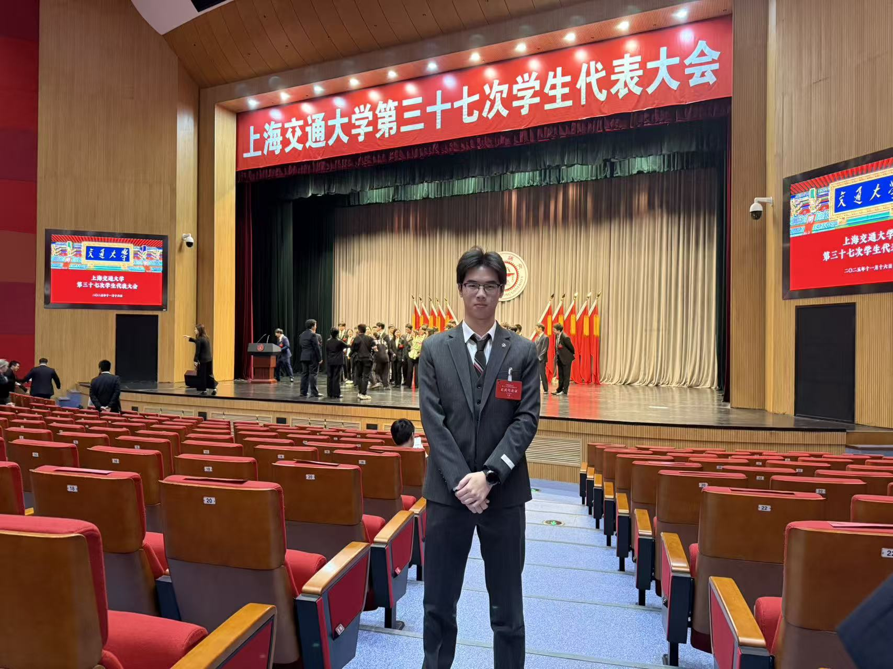

# Hi, I'm He Wang 👋

I am an undergraduate student in the **2026 cohort** at the  
**School of Automation and Intelligent Sensing, Shanghai Jiao Tong University (SJTU)**, majoring in **Intelligent Sensing Engineering**.

I am interested in intelligent sensing, robotics, control, and human–machine interaction. Through hands-on engineering projects, I hope to strengthen my understanding of control systems, algorithms, and perception theory.

 

## Education

**Shanghai Jiao Tong University (SJTU)**  
B.Eng. Student in Intelligent Sensing Engineering  
School of Automation and Intelligent Sensing  
2026 Cohort · Shanghai, China

## Current Work

### Mechanical Decoupling of a da Vinci Robotic Gripper

I am currently studying the mechanical structure of a da Vinci robotic gripper, with a focus on understanding and decoupling its coupled mechanical motions.

## Completed Project

### Intelligent Sensing Engineering: Haptic Perception and Human–Machine Interaction

A haptic interaction project developed using the **Phantom Omni** device.

- Implemented real-time acquisition of pose data and interaction states from the Phantom Omni.
- Collected and processed end-effector motion information.
- Built a virtual paper-writing environment that simulated contact between the device end-effector and a virtual plane.
- Reproduced a basic writing interaction within the virtual environment.
- Generated constraint forces according to the contact state between the device and the virtual paper.
- Implemented basic force feedback and haptic interaction.

## Learning Goals

I plan to further study:

- Control theory and control systems
- Algorithms
- Perception and sensing theory
- Robotics and intelligent systems

My goal is to connect theoretical knowledge with practical engineering and continuously improve my problem-solving and implementation skills.

## Campus Life

  

## Contact

- Email: [wanghe7726@163.com](mailto:wanghe7726@163.com)
- GitHub: [@chiyeeheh](https://github.com/chiyeeheh)
